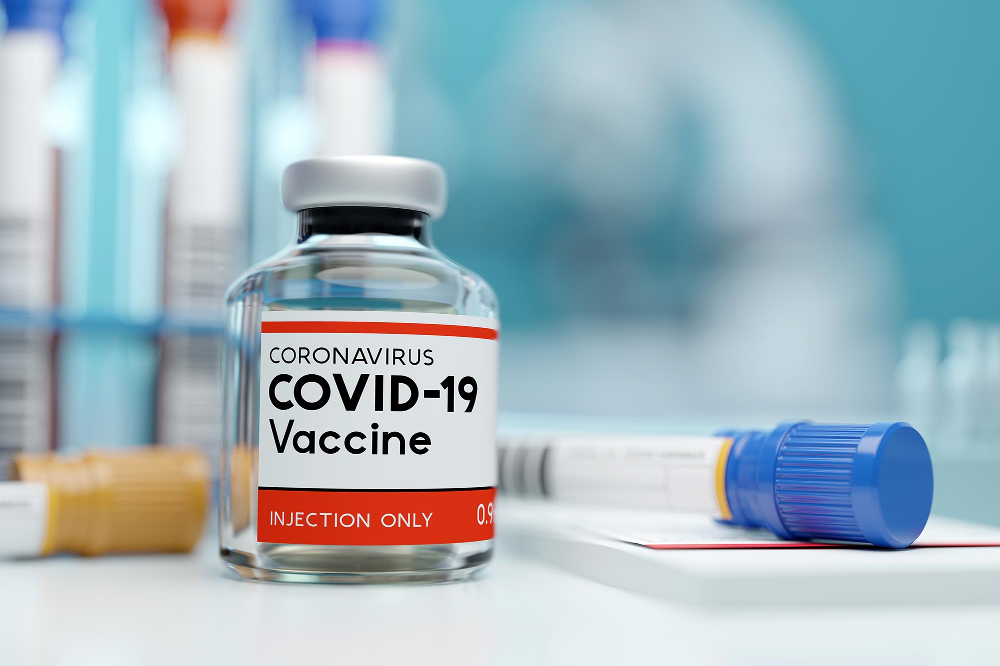

# Project 1

# COVID-19 - Who should get the vaccine first?

## Team Members

* Harry Feldman
* Jessica Pardo
* Charles Philpott
* Alex Jones

## Project Description/Outline

COVID-19 (Coronavirus disease 2019) is a contagious disease that affected over 72 Million people over the world. In the United States, 16.4 Million have contracted COVID-19 disease and caused the death of 300 thousand people. Several Pharmaceutical companies are working on developing a vaccine for COVID-19 and once available, it will be limited to a target population. The big question is who should get the vaccine first?

The objective of our group project was to determine who the initial recipients of the COVID-19 vaccine should be.

## Research Question to Answer

The aim of the study was to analyze different combinations of available data to determine a correlation between factors such as:

* Date of First Positive Specimen Collection
* Symptom Onset Date
* Current Status
* Sex
* Age Group
* Race and Ethnicity
* Hospitalization Status
* ICU Admission Status
* Presence of Underlying Comorbidity or Disease

The purpose was to create a decision tool to help health care providers distribute vaccines.

## Dataset Used

The datasets utilized for this analysis are sourced from cdc.gov and healthdata.gov.
1. [COVID-19 Case Surveillance Public Use Data Profile](https://data.cdc.gov/Case-Surveillance/COVID-19-Case-Surveillance-Public-Use-Data-Profile/xigx-wn5e)
2. [Hospital Capacity Data](https://healthdata.gov/sites/default/files/reported_hospital_utilization_timeseries_20201213_2141.csv)
3. [Conditions contributing to deaths involving coronavirus disease](https://data.cdc.gov/NCHS/Conditions-contributing-to-deaths-involving-corona/hk9y-quqm)

## Rough Breakdown of Tasks

* Data Cleanup
* General Plots and Information
* Visualizations
* Regression Analysis
* Interpretation
* Presentation

## Analysis and Results

More details of the analysis and visualization of the graphs can be seen in the Presentation Jupyther notebook: [Presentation](Presentation%20Notebook.ipynb)

